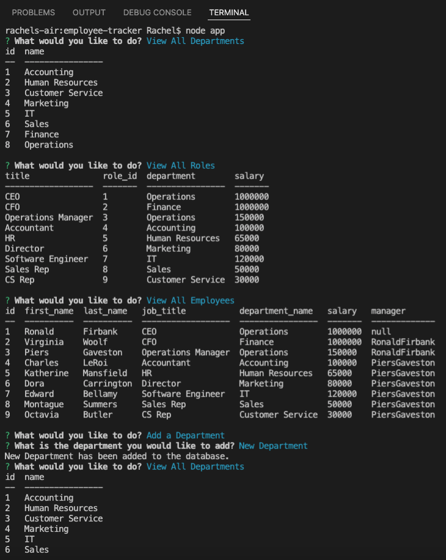

# Employee Tracker

## Description
    
Command line app to view and manage the departments, roles, and employees in a company, in order to organize and plan.

## Built With
* Node.js
* Inquirer NPM
* JavaScript
* MySQL

## GitHub Link
https://github.com/Rachel8078/employee-tracker

## Video Walkthrough Link
https://drive.google.com/file/d/1HYdWM-wwqH17q-F4WtcrA08TlrTUDQEz/view

## Screenshot

## Contribution
Made by Rachel Marriott
